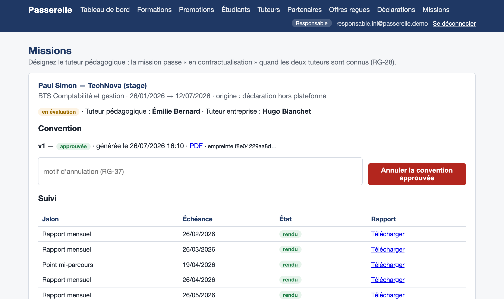
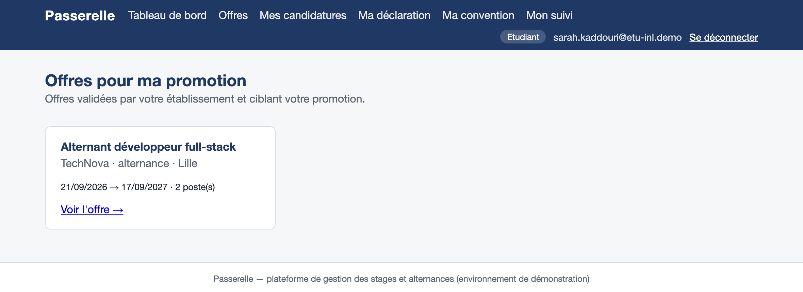
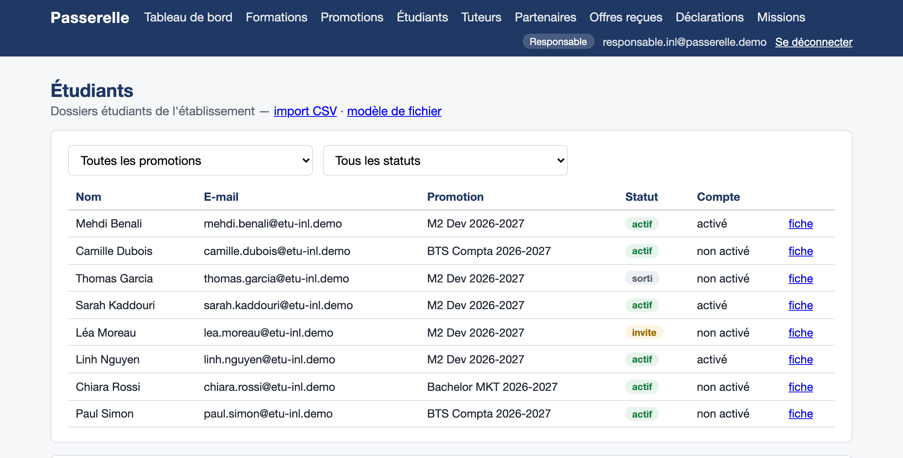
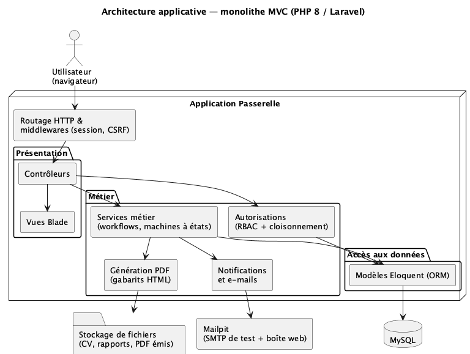
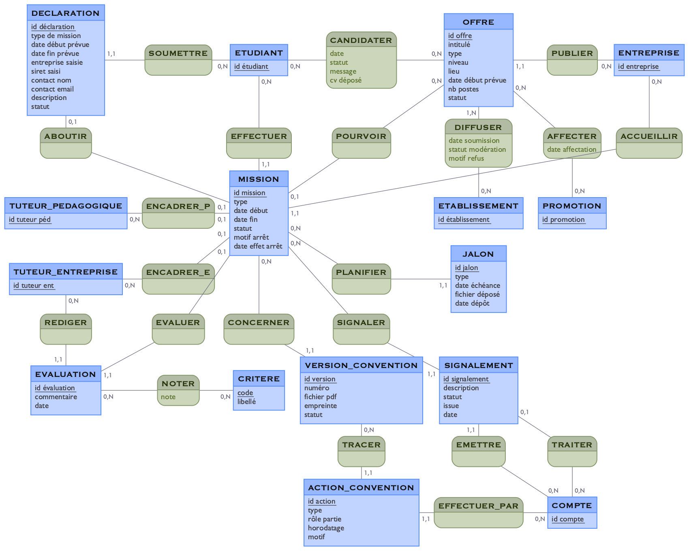
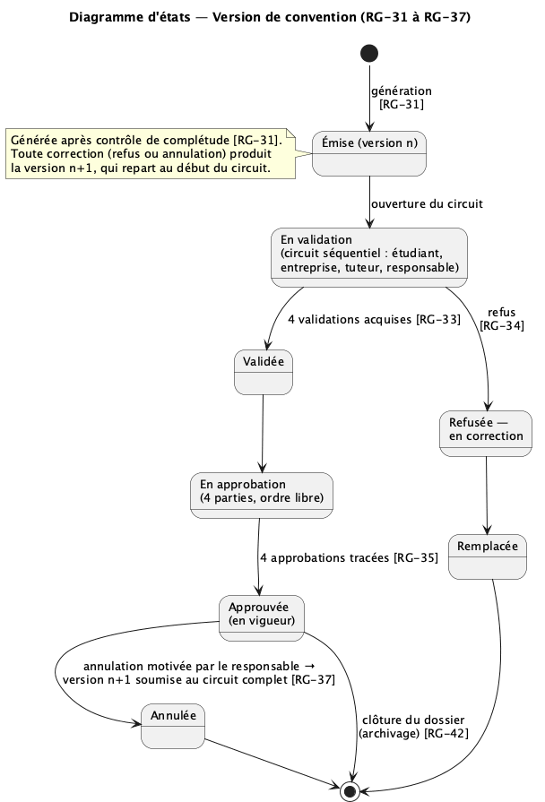
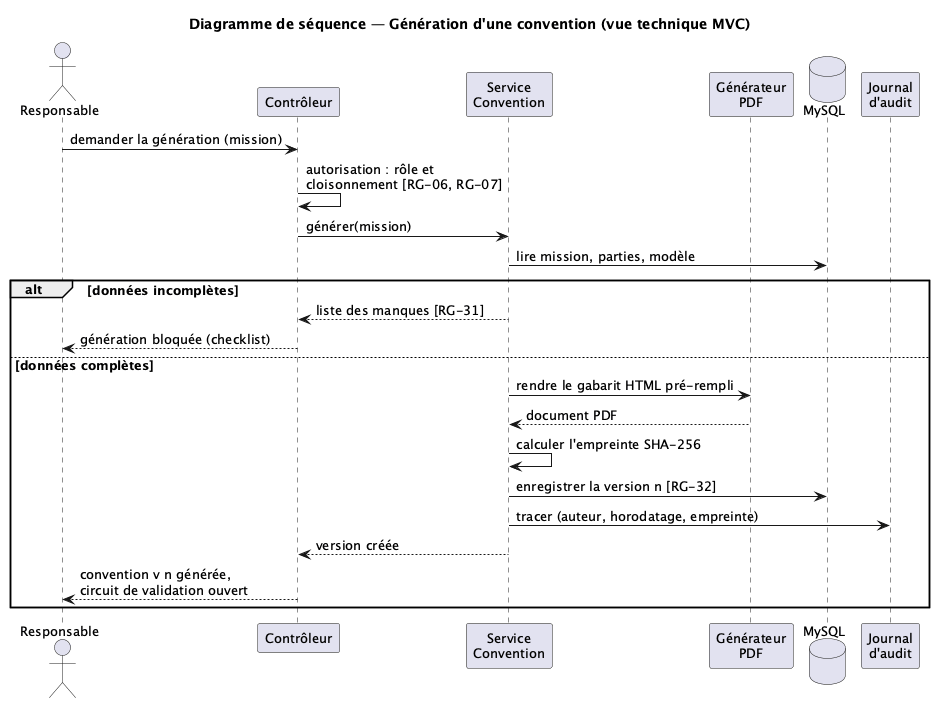

# Passerelle — stages et alternances entre écoles, entreprises et étudiants

[](https://github.com/gaguaoussamaa/passerelle-ecoles-entreprises/actions/workflows/tests.yml)

Application web en **PHP 8.4 / Laravel 13 / MySQL 8**. Elle relie une école, ses étudiants et les entreprises partenaires sur tout le cycle d'un stage ou d'une alternance : offres, candidatures, convention, suivi et évaluation.

> Projet de fin d'études individuel (Master 2, 2026). Le dépôt contient le code et la documentation technique ; les livrables académiques n'en font pas partie.



## Ce que fait l'application

| Rôle | Ce qu'il fait |
|---|---|
| **Responsable d'école** | Formations, promotions et tuteurs. Il importe les étudiants par CSV (avec un rapport ligne à ligne) et gère les partenariats et la modération des offres. Il traite aussi les déclarations, les missions et les conventions. |
| **Entreprise** | Publie des offres ciblées sur des formations, instruit les candidatures et suit ses missions. |
| **Étudiant** | Consulte les offres de sa promotion et y postule (le CV est figé au dépôt). Il peut aussi déclarer un stage trouvé hors plateforme, puis suit sa convention et ses jalons. |
| **Tuteur pédagogique** | Approuve les conventions et suit les missions qui lui sont confiées. |
| **Super-administrateur** | Gère les établissements et les comptes des responsables. |

Deux chemins mènent à une mission : une **candidature acceptée** sur la plateforme, ou la **déclaration** d'un stage trouvé par l'étudiant. Ils aboutissent à la même convention et au même suivi.

| Offres d'une promotion (étudiant) | Dossiers étudiants (responsable) |
|---|---|
|  |  |

## Architecture

L'application est un monolithe MVC Laravel :
- des contrôleurs par espace ;
- des **services métier** pour les workflows ;
- des modèles Eloquent et des vues Blade ;
- la génération PDF avec dompdf ;
- l'envoi d'e-mails (Mailpit en démonstration).



```
passerelle/
├── app/Http/Controllers/   un dossier par espace : Admin, Ecole, Entreprise, Etudiant, Tuteur, Auth
├── app/Http/Middleware/    VerifierRole, VerifierAcces (cloisonnement), EntetesSecurite
├── app/Services/           ConventionService, ImportEtudiantsService, InvitationService
├── app/Models/             24 modèles Eloquent
├── database/migrations/    schéma complet : 28 tables, contraintes portées par la base
├── database/seeders/       jeu de démonstration (données fictives)
├── resources/views/        vues Blade par espace et gabarits PDF
└── tests/                  tests PHPUnit (Feature par module, Unit)
docker/                     image PHP 8.4 / Apache, Caddyfile (HTTPS de la production simulée)
```

## Modèle de données

Les 28 tables portent elles-mêmes les règles importantes : contraintes `CHECK`, unicités et clés étrangères. Pour cette raison, les tests tournent sur **MySQL** et non sur SQLite : ces contraintes font partie du comportement testé.



D'autres diagrammes (architecture de déploiement, modèle des acteurs) sont dans [`docs/`](docs/).

## Points techniques

- **Conventions versionnées et immuables.**
  - Chaque génération produit un PDF avec une empreinte SHA-256.
  - Une version refusée ou annulée n'est jamais modifiée : elle est remplacée par une nouvelle version.
  - L'approbation suit un circuit séquentiel entre les parties, puis l'échéancier de suivi est créé.
- **Suivi des missions** : des états calculés, des rapports déposés aux jalons, la détection des retards, des signalements et l'interruption.
- **Import CSV des étudiants** :
  - les lignes valides créent un compte « invité » et envoient une invitation par e-mail ;
  - les lignes invalides sont rejetées avec leur motif.
- **Cloisonnement par établissement.**
  - Un responsable ne voit que les données de son école.
  - Les contrôles sont faits côté serveur, par les middlewares et les services, pas seulement dans l'interface.
- **Journal d'audit** des actions sensibles.

| Cycle de vie d'une version de convention | Génération d'une convention |
|---|---|
|  |  |

## Sécurité

- **Connexion** : limitation des tentatives et message d'erreur générique, qui ne révèle pas si un compte existe.
- **Mots de passe** : 12 caractères minimum.
- **En-têtes HTTP** : `X-Frame-Options`, `X-Content-Type-Options`, `Referrer-Policy`, et HSTS en HTTPS.
- **Fichiers déposés** : PDF uniquement, 2 à 4 Mo au plus, stockés hors de la racine web. Le téléchargement passe par des contrôleurs qui vérifient les droits.
- **Production simulée**, vérifiée par un script (`demarrer-production.sh`) :
  - mode production, sans trace d'erreur exposée ;
  - cookies `Secure` et sessions chiffrées ;
  - reverse-proxy Caddy en HTTPS.

## Tests

89 tests PHPUnit, fonctionnels par module et unitaires, exécutés sur MySQL. Ils couvrent :
- le parcours de chaque rôle ;
- les règles métier (convention, suivi, évaluation) ;
- le cloisonnement entre établissements ;
- les protections de sécurité.

Ils tournent à chaque push avec GitHub Actions.

## Lancer le projet

Seul Docker est nécessaire : PHP et Composer s'exécutent dans des conteneurs.

```bash
git clone https://github.com/gaguaoussamaa/passerelle-ecoles-entreprises.git
cd passerelle-ecoles-entreprises
bash demarrer.sh
```

- Application : http://localhost:8000
- E-mails de test (Mailpit) : http://localhost:8025
- Comptes de démonstration (mot de passe commun `Passerelle2026!`) : `admin@passerelle.demo`, `responsable.inl@passerelle.demo`, `contact@technova.demo`. La liste complète est dans l'en-tête de `demarrer.sh`.

```bash
# Tests
docker exec passerelle-app php artisan test

# Production simulée en HTTPS local (https://localhost:8443), puis retour automatique à la démo
bash demarrer-production.sh
```

## Limites et pistes

- **Pas encore de politique CSP stricte** : il faudrait d'abord retirer quelques gestionnaires d'événements et styles écrits en ligne.
- **Interface volontairement simple** (Blade et CSS, sans framework front).
- **Déploiement** : la production est simulée en local. Un vrai déploiement demanderait un certificat public, des sauvegardes et une messagerie réelle.
